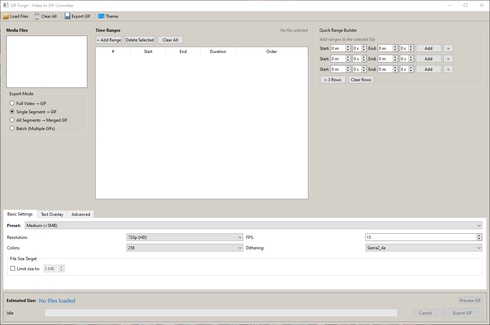

# GIF Forge

A modern desktop application for converting videos to high-quality GIFs with advanced customization options.



## Features

- **Multiple Export Modes** - Full video, single segment, merged segments, or batch processing
- **Smart Presets** - Tiny (<1MB), Small (<2MB), Medium (<5MB), Large (<10MB), High Quality
- **Real-time Size Estimation** - See estimated file size before exporting
- **Text Overlay** - Add customizable text with position, font, color, outline, and background options
- **Playback Effects** - Speed control (0.25x - 4x), reverse, and boomerang effects
- **Advanced Optimization** - Palette optimization, dithering options, and lossy compression
- **Dark/Light Theme** - Toggle between themes for comfortable editing

## Quick Start

### Requirements

- Python 3.10+
- FFmpeg (ffmpeg.exe and ffprobe.exe)

### Installation

1. Clone the repository
   ```bash
   git clone https://github.com/ZxPwd/gif-forge.git
   cd gif-forge
   ```

2. Install dependencies
   ```bash
   pip install -r requirements.txt
   ```

3. Download [FFmpeg](https://ffmpeg.org/download.html) and place `ffmpeg.exe` and `ffprobe.exe` in the project folder

4. Run the application
   ```bash
   python main.py
   ```

**Windows Users:** Simply double-click `run_gif_forge.bat` to auto-install dependencies and launch.

## Usage

1. **Load Videos** - Click "Load Files" or press `Ctrl+O`
2. **Select Export Mode** - Choose from Full Video, Single Segment, Merged, or Batch
3. **Add Time Ranges** - Use the Quick Range Builder to define segments
4. **Configure Settings** - Adjust quality, add text overlays, set effects
5. **Export** - Click "Export GIF" or press `Ctrl+E`

## Keyboard Shortcuts

| Shortcut | Action |
|----------|--------|
| `Ctrl+O` | Load Files |
| `Ctrl+E` | Export GIF |
| `Delete` | Delete Selected Segments |

## Export Presets

| Preset | Resolution | FPS | Colors | Target Size |
|--------|------------|-----|--------|-------------|
| Tiny | 320px | 10 | 128 | <1MB |
| Small | 480px | 12 | 256 | <2MB |
| Medium | 640px | 15 | 256 | <5MB |
| Large | 800px | 20 | 256 | <10MB |
| High Quality | Source | 24 | 256 | Unlimited |

## Supported Formats

MP4, MOV, AVI, MKV, WebM, FLV

## Tech Stack

- **Python** - Core language
- **PySide6** - Cross-platform GUI framework
- **FFmpeg** - Video processing engine

## License

MIT License - Feel free to use, modify, and distribute.

---

Created by **ZxPwd**
